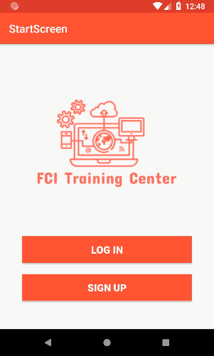
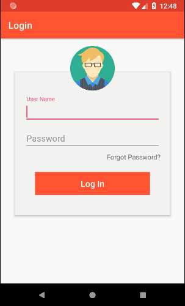
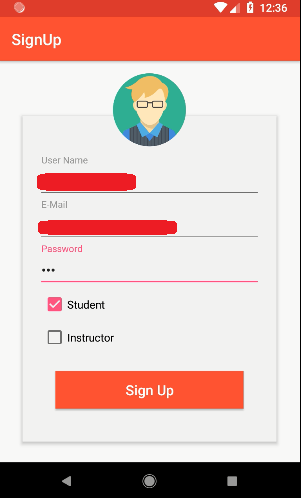
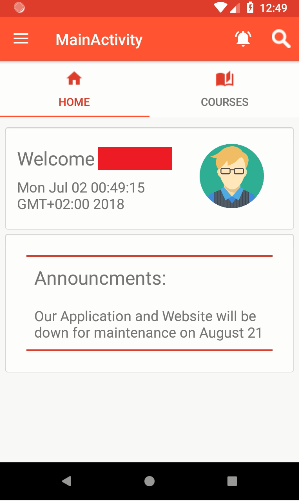
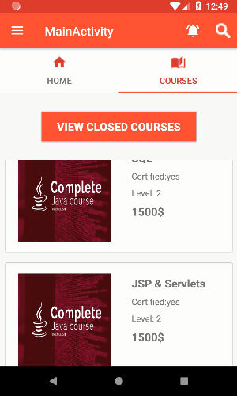
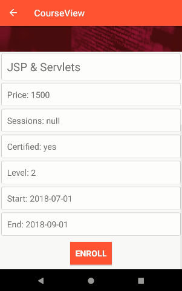
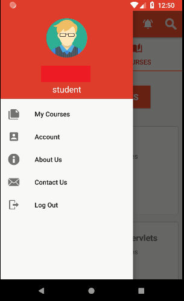

# FCI Training Center-Android APP
Android App that displays available courses for students, where students can view, enroll & receive  announcements about enrolled courses.
There is a separate website that contains an admin panel to add, remove & update courses.
This App connected with the website through a php webservice.

## Screenshots:

## Technologies & Libraries Used:
* XAMP
* Postman
* Retrofit
* Gson

## PHP Webservice Functions:
* Signup:
	- Input: type,username,password,email,university,college,qualifications,address,phone,ssn.
	- Output: '(true)' in case of successful insertion,'(false)' in case of error.
* Login:
	- Input: user name, password.
	- Output: '(true:student)' in case of successful login as a student.
        '(true:instructor)' in case of successful login as an instructor.
		'(false:error)' in case of error.
* Get Course:
	- Input: course name.
	- Output: JSONObject contains all details about this course.
* All Courses:
	- Input: no input.
	- Output: JSONArray contains all courses with details.
* Closed Courses:
	- Input: no input.
	- Output: JSONArray contains names of all closed courses.
* Enroll:
	- Input: Course ID, Student ID.
	- Output: ("User enrolled Successfully") in case of successfully enrolled, ("false") in case of error.
